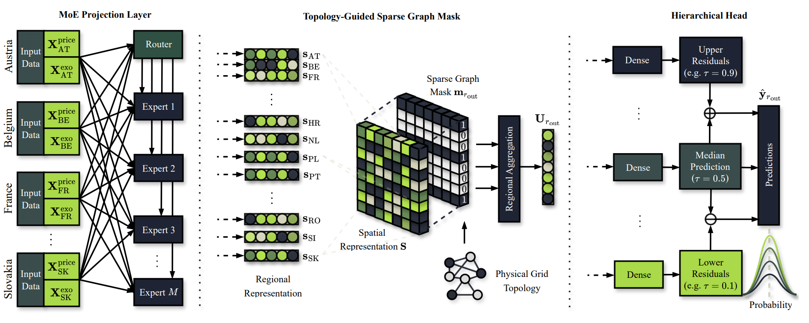

# PriceFM
Foundation Model for Probabilistic (Day-Ahead) Electricity Price Forecasting

🦊 Summary page: https://runyao-yu.github.io/PriceFM/

🌋 Paper link: https://www.arxiv.org/pdf/2508.04875



---

## 📢 Updates

### April 2026

- Pretrained model (`model/PhaseI_best.keras`) is now available
- A tutorial in fine-tuning the pretrained model is provided (`FM_Tutorial.ipynb`)
- `requirements.txt` is updated to ensure robustness of package version

### March 2026
- Dataset extended from **2022–2025** to **2022–2026**
- Temporal resolution increased from **hourly** to **quarter-hourly**
- Evaluation expanded from **1 test fold in 2024-2025** to **3 test folds in 2025-2026**
- Model architecture upgraded to a **Mixture-of-Experts (MoE)** design
- Graph mask simplified from a decay formulation to a **sparse mask**

---

## 🚀 Quick Start

We open-source all code for preprocessing, modeling, and analysis.  
The project directory is structured as follows:

    PriceFM/
    ├── Data/
    ├── Figure/
    ├── Model/
    ├── Result/
    ├── PriceFM/
        ├── data.py
        ├── model.py
        ├── evaluation.py
    ├── FM_Tutorial.ipynb
    ├── README.md
    ├── requirements.txt

The file `README.md` specifies the required package versions.

To facilitate reproducibility and accessibility, we have streamlined the entire pipeline into just three simple steps:

### 🌵 Step 1: Download the dataset

You can download the dataset from https://huggingface.co/datasets/RunyaoYu/PriceFM/tree/main 
Ensure that the energy dataset `FINAL.csv` is in the `Data` folder.

### 🌵 Step 2: Run the Pipeline

Run `FM_Tutorial.ipynb` to:
- [optional] if you want to use Google Colab, read `Google_Colab_Instruction.pdf`
- Preprocess the energy data
- Use or fine-tune the PriceFM model

### 🌵 Step 3: Check Results

After execution, check:
- `Model/` for saved model weights  
- `Result/` for evaluation metrics and outputs

---

## 📦 Environment & Dependencies

This project has been tested with the following environment (see `requirements.txt`):

- **Python 3.11.13**
- `numpy==2.0.2`
- `pandas==2.2.2`
- `scikit-learn==1.6.1`
- `scipy==1.15.3`
- `tensorflow==2.18.0`
- `h5py==3.14.0`
- `joblib==1.5.1`
- `setuptools==75.2.0`

Use the following command to install dependencies:

```bash
pip install numpy==2.0.2 pandas==2.2.2 scikit-learn==1.6.1 scipy==1.15.3 tensorflow==2.18.0 h5py==3.14.0 joblib==1.5.1 setuptools==75.2.0